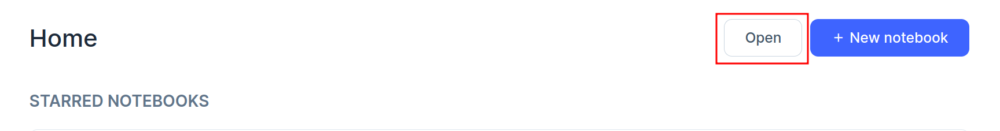

# EsCqrsAnatomy

## Build the image 

``` docker build --no-cache -t escqrsanatomy . ```

## Start the compose

``` docker compose up -d```

## Open the livebook

1. go to ```http://localhost:8080/``` 

2. Insert the password: ```es-cqrs-anatomy```

3. Open the livebook




4. Run the setup


Enjoy!
